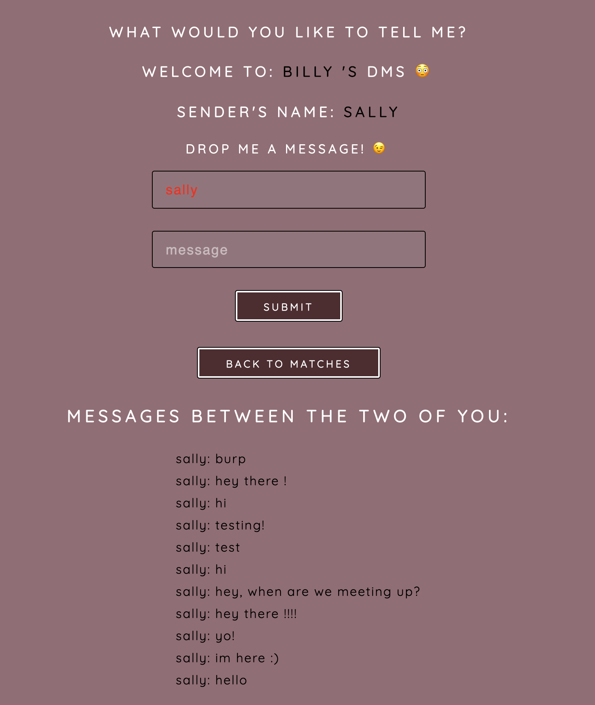
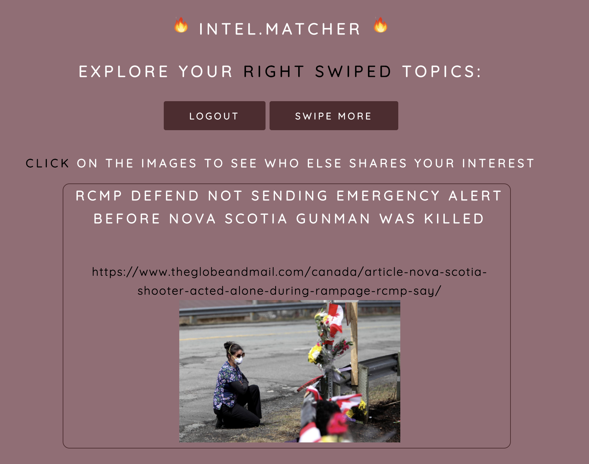

# Intel.Matcher
Full Stack Application that is meant to recreate common dating apps but with a more intellectual purpose. This is Tinder for News Geeks. IntelMatcher is a platform where users can learn more about current events and the world around them, and then connect with others who have that same interest and curiosity. The application is built so that any user can create a profile, right or left swipe on topics of interest, match and start chatting with others they intellectually click with!

## Heroku Link
https://intel-matcher-2.herokuapp.com/

### Tech Used: HTML , CSS , JS , Node.js , MongoDB , Express , EJS, Google News API

## Portfolio Link
https://kennethscruz.com/

##HomePage

##SwipingPage

##Favorites Board Page

##Direct Messages Page

